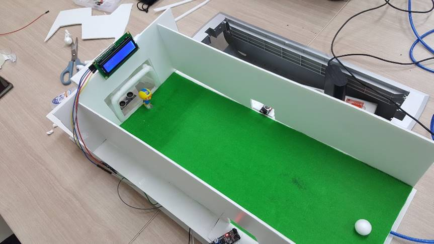
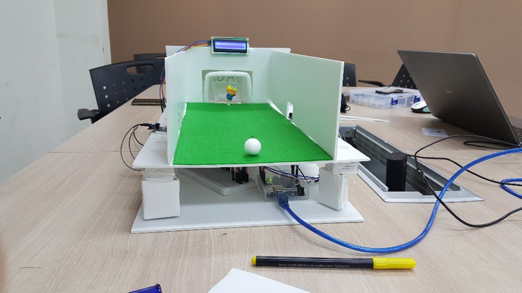
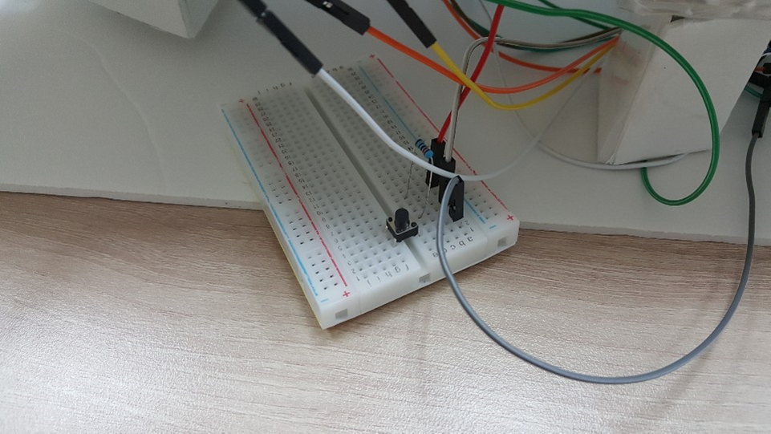
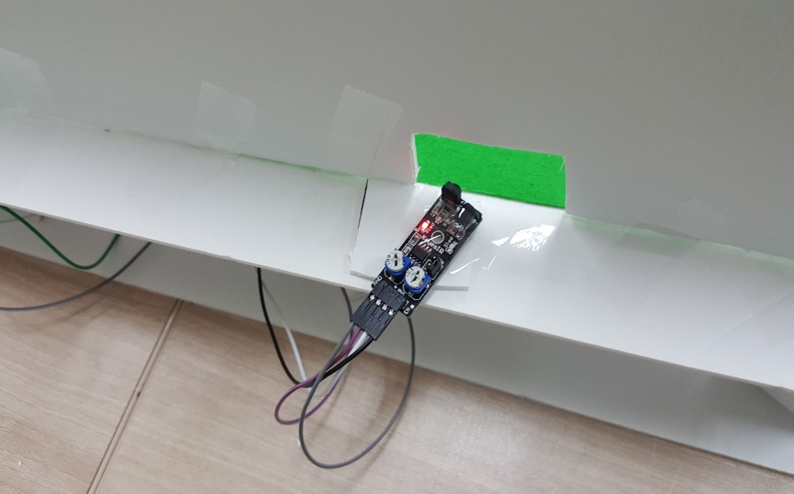
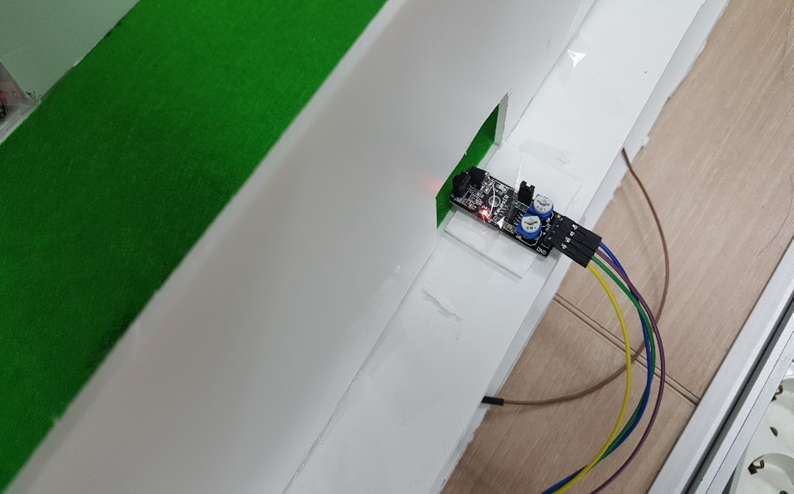
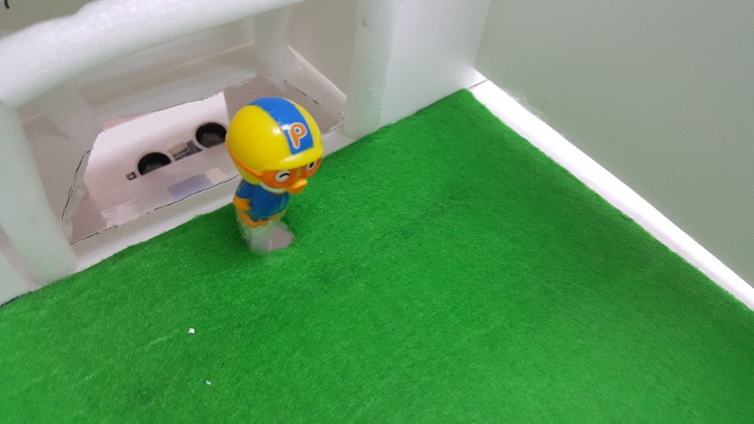
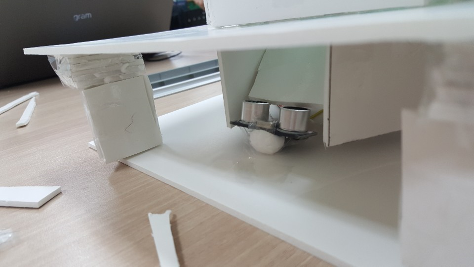
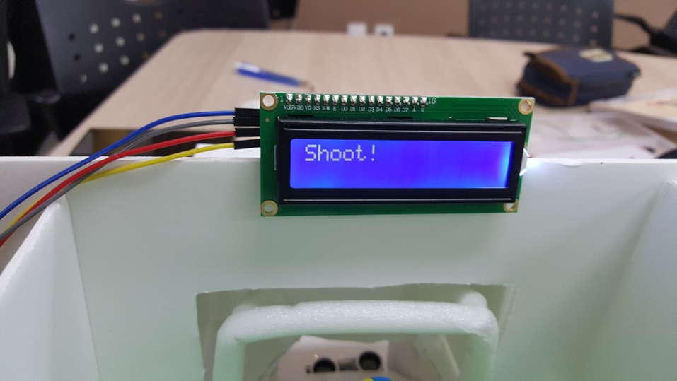

# Penalty kick

> 2019 - 2학기 RobotC Team-Project

  > By using Arduino

## Motivation
  > For Team project of Robotics  
  > ... and just for **FUN!!**
## Image
  
  
## Architecture
  1. Start if suer press *Start* **Button**
  2. Infrared sensor starts *ball* **Recognize**  

    If ball was recognized?
      Move goalkeeper to that direction
    If not ( about 2 seconds )
      Don't move goalkeeper
  3. Check whether **Goal** or **Not**

    If goal?
      Print "Congrations" to LCD
    If not
      Print "No Goal" to LCD
  4. End program
## Component
### Button
  
  * By pressing this button, User can start Penalty kick
### Infrared Sensor
  
  
  * There is 2 Infrared sensors, both sides of field
  * By using these sensors, we can recognize moving ball
### Servo Motor
  
  * If infrared sensors recognize moving ball, Servo motor moves to defense the ball
### Ultrasonic Sensor
  
  * Check whether Goal or Not
### LCD ( Liquid-Crystal Display )
  

  * Signs appear here ( Shoot / Congratulatios / No goal )